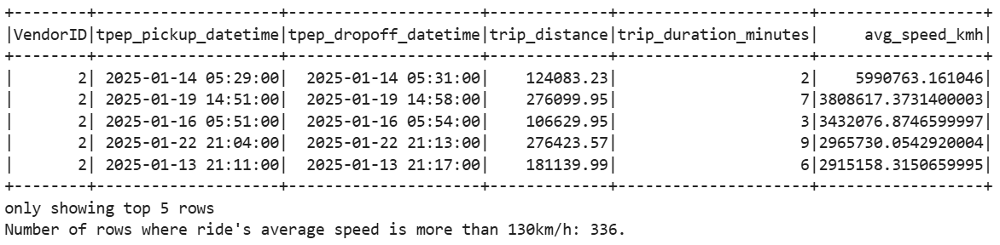
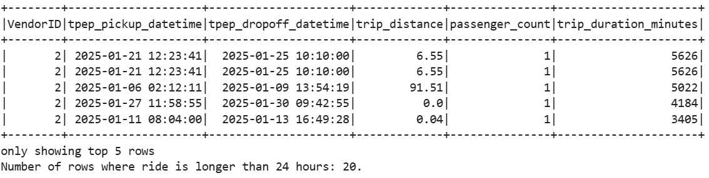
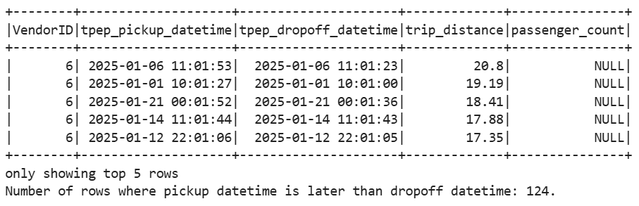

# Project 1

This is a report for project 1.

To start up the program run the following code in /'Project 1' folder.

```bash
docker compose up -d
```

Jupyter Notebook can be accessed through: <http://localhost:8888>

Spark can be accessed through: <http://localhost:4040>

## Correctness

Here are the row counts for each input table.

### yellow_tripdata_2025-01.parquet

| Stage | Row Count |
| - | - |
| Raw input | 3 475 226 |
| After cleaning | 2 856 235 |
| After dedup | 2 760 230 |

### yellow_tripdata_2025-02.parquet

| Stage | Row Count |
| - | - |
| Raw input | 3 577 543 |
| After cleaning | 2 694 244 |
| After dedup | 2 604 692 |

### taxi_zone_lookup.parquet

| Stage | Row Count |
| - | - |
| Raw input | 265 |
| After cleaning | 265 |
| After dedup | 265 |

### trips_enriched.parquet

| Stage | Row Count |
| - | - |
| Final output | <span style="color: red">5 364 922?? |

### Rule documentation

There are in total nine checks for trips data and three checks for zones data.

#### Trip checks

1) Passenger count cannot be null or less/equal to zero;
2) Trip distance cannot be negative;
3) Trip pick up time (start) cannot be after trip drop off time (ending);
4) Ratecode ID should be a number ranging from 1-6 or 99 based on NYC TLC data dictionary;
5) Payment type should be a number ranging from 0-6 based on NYC TLC data dictionary;
6) Trip duration shouldn't be less than 0 minutes; (<span style="color: red">0 minutes?</span>)
7) Trip duration shouldn't be more than 24 hours (NYC taxis aren't usually given out for more than a day);
8) Average speed shouldn't be under 2km/h;
9) Average speed shouldn't be over 130km/h.

#### Zone checks

1) Location ID cannot be missing or negative;
2) Borough cannot be missing or empty;
3) Zone cannot be missing or empty.

#### Defined keys

Trips are defined by a unique key containing vendor ID, pick up time and pick up location, because there cannot logistically be a vendor that picks up more than one trips at the same time in the same place.

Zones are defined by their own unique key Location ID.

### Examples of bad rows

#### Trip's average speed (duration/distance) is exceptionally high



#### Trip's duration is more than one day



#### Trip's drop off datetime is before trip's pick up datetime



## Performance

<span style="color: red">TODO: runtime for the full job</span>

<span style="color: red">TODO: two Spark Web UI screenshots</span>

<span style="color: red">TODO: two concrete optimization choices (broadcast?)</span>

## Scenario

Our scenario was as follows:

*Add a boolean column is_peak_hour to the output. Peak = Monday-Friday, 07:00-09:00 or 16:00-19:00 (local time). Document your definition. The README must show the count of peak vs non-peak trips.*

We solved it by adding the is_peak_hour column into the output. The definition is as told in the scenario using NYC timezone. Meaning that if a trip is started Mon-Fri at 07:00-09:00 or 16:00-19:00, then the is_peak_hour flag would show 'true' and otherwise 'false'.
<span style="color: red">TODO: show peak vs. non-peak (should this be for both files or for at least one of them?)</span>
