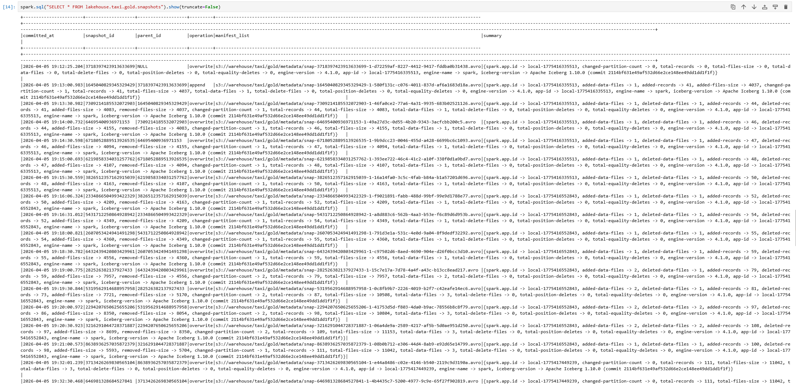
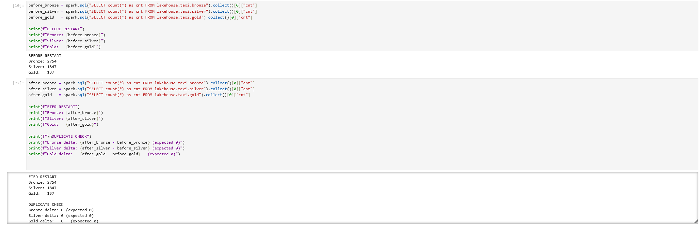
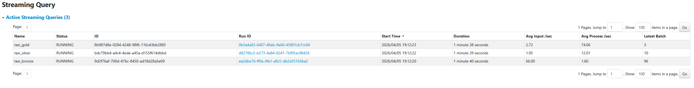
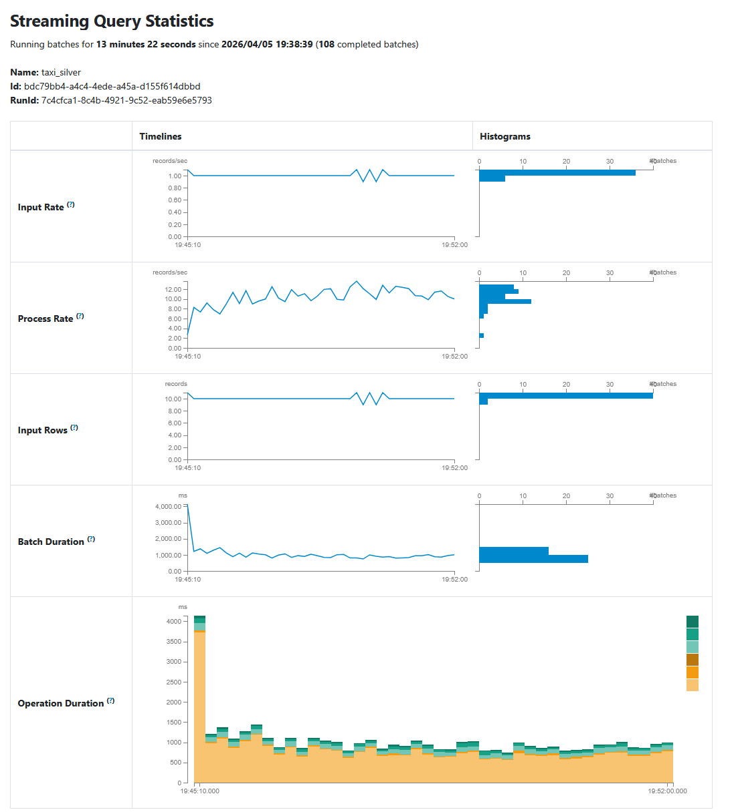
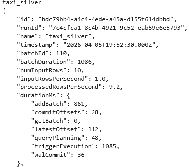
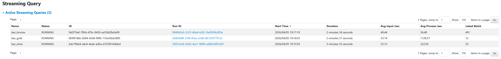
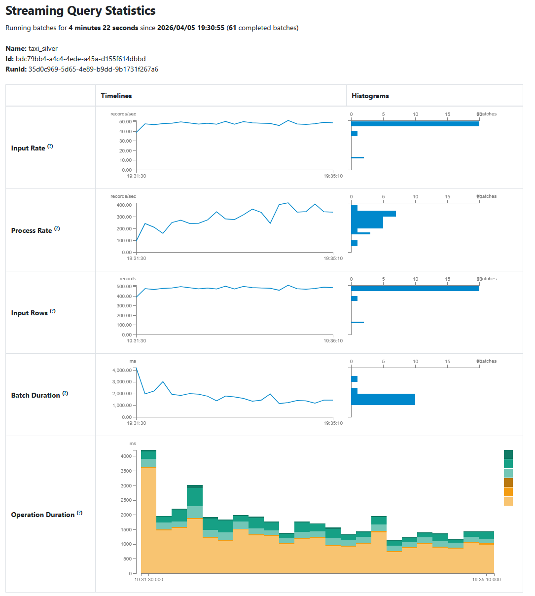
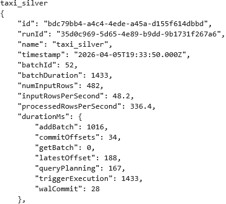

# Project 2: Streaming Lakehouse Pipeline

## 1. Medallion layer schemas

### Bronze

```sql
CREATE TABLE lakehouse.taxi.bronze (
    kafka_key        STRING,
    raw_value        STRING,
    topic            STRING,
    partition        INT,
    offset           BIGINT,
    kafka_timestamp  TIMESTAMP
) USING iceberg
```
Bronze stores raw Kafka messages as-is without any parsing or transformation. `raw_value` contains the original JSON string from the producer. `kafka_key` is
the Kafka message key. `topic`, `partition`, and `offset` identify the exact position of the message in Kafka. `kafka_timestamp` is the time the message was written to Kafka. No cleaning is applied here.

### Silver

```sql
CREATE TABLE lakehouse.taxi.silver (
    VendorID                INT,
    tpep_pickup_datetime    TIMESTAMP,
    tpep_dropoff_datetime   TIMESTAMP,
    passenger_count         INT,
    trip_distance           DOUBLE,
    RatecodeID              INT,
    store_and_fwd_flag      BOOLEAN,
    PULocationID            INT,
    DOLocationID            INT,
    payment_type            INT,
    fare_amount             DOUBLE,
    extra                   DOUBLE,
    mta_tax                 DOUBLE,
    tip_amount              DOUBLE,
    tolls_amount            DOUBLE,
    improvement_surcharge   DOUBLE,
    total_amount            DOUBLE,
    congestion_surcharge    DOUBLE,
    Airport_fee             DOUBLE,
    cbd_congestion_fee      DOUBLE,
    trip_duration_minutes   INT,
    avg_speed_kmh           DOUBLE,
    pickup_zone             STRING,
    pickup_borough          STRING,
    dropoff_zone            STRING,
    dropoff_borough         STRING,
    kafka_timestamp         TIMESTAMP
) USING iceberg
```
Compared to bronze, silver parses the `raw_value` JSON into typed columns. Columns are cleaned (see cleaning rules in section 3). Two derived columns are added: `trip_duration_minutes` and `avg_speed_kmh`. Zone names are joined from the `taxi_zone_lookup` table. Duplicates are removed.

### Gold
```sql
CREATE TABLE lakehouse.taxi.gold (
    day            DATE,
    pickup_zone    STRING,
    trip_count     LONG,
    avg_distance   DOUBLE,
    avg_fare       DOUBLE,
    avg_total      DOUBLE,
    tip_rate_pct   DOUBLE,
    total_revenue  DOUBLE
) USING iceberg
PARTITIONED BY (day)
```
Gold aggregates silver by `(day, pickup_zone)`. Each row represents the aggregated trip statistics for one pickup zone on one day.
- `trip_count` - total number of trips
- `avg_distance` - average trip distance in miles
- `avg_fare` - average base fare
- `avg_total` - average total amount charged
- `tip_rate_pct` - percentage of trips where a tip was given
- `total_revenue` - sum of all `total_amount` values

Partitioned by `day` so date-range queries scan only relevant partitions.
Updated via `MERGE INTO` on `(day, pickup_zone)` so restarts are idempotent.

## 2. Cleaning rules and enrichment

### Type casting

The Kafka JSON payload serializes all numeric fields as floating point (e.g. 
`"passenger_count": 2.0`). Fields are parsed as DOUBLE and then cast to their 
correct types: `passenger_count`, `RatecodeID`, and `payment_type` are cast to 
INT. `store_and_fwd_flag` is cast from `"Y"/"N"` string to BOOLEAN.

### Cleaning rules

| Rule | Filter | Justification |
|------|--------|---------------|
| Null passenger count | `passenger_count IS NOT NULL AND > 0` | A trip with no passengers is invalid |
| Non-negative distance | `trip_distance >= 0` | Negative distance is physically impossible |
| Valid trip direction | `dropoff_datetime > pickup_datetime` | Dropoff must be after pickup |
| Valid RatecodeID | `RatecodeID IN (1,2,3,4,5,6,99)` | Per NYC TLC data dictionary; 99 = unknown |
| Valid payment type | `payment_type IN (0,1,2,3,4,5,6)` | Per NYC TLC data dictionary |
| Positive duration | `trip_duration_minutes > 0` | Zero duration means corrupt timestamps |
| Realistic duration | `trip_duration_minutes < 1440` | NYC yellow taxis do not make multi-day trips |
| Minimum speed | `avg_speed_kmh >= 2` | Below 2 km/h suggests corrupt timestamps |
| Maximum speed | `avg_speed_kmh <= 130` | Above 130 km/h is unrealistic for NYC roads |

### Deduplication

Duplicate records are removed using the key `(VendorID, tpep_pickup_datetime, 
PULocationID)`. The same vendor cannot start two trips from the same location at 
the exact same timestamp — any such duplicates are assumed to be repeated Kafka 
messages rather than distinct trips.

### Enrichment

Trips are enriched with human-readable zone names by joining the 
`taxi_zone_lookup.parquet` reference table on `PULocationID` and `DOLocationID`. 
This adds `pickup_zone`, `pickup_borough`, `dropoff_zone`, and `dropoff_borough` 
columns. A left join is used so that trips with unknown location IDs are retained 
rather than dropped.

## 3. Streaming configuration

### Checkpointing

Each stream uses a dedicated checkpoint in:

- /tmp/checkpoints/taxi_bronze
- /tmp/checkpoints/taxi_silver
- /tmp/checkpoints/taxi_gold

They store: 
- Kafka offsets
- streaming progress
- batch metadata

This guarantees exactly-once processing and safe restarts without duplicates

### Trigger intervals
| Layer  | Trigger                          |
| ------ | -------------------------------- |
| Bronze | default (continuous micro-batch) |
| Silver | 10 seconds                       |
| Gold   | 30 seconds                       |
This way bronze layer ingests continuously, silver layer balances latency vs processing cost and gold aggregates less frequently to reduce overhead

### Output mode
| Layer  | Mode                 |
| ------ | -------------------- |
| Bronze | append               |
| Silver | foreachBatch + MERGE |
| Gold   | foreachBatch + MERGE |

So bronze is raw append-only ingestion, but Silver and Gold have idempotent upserts.

### Watermark

No watermark is used due to the deterministic way of producing the data (from the taxi-rides .parquet files) via produce.py and we dont have windwoing.

## 4. Gold table partitioning strategy

Partitioning by day matches the access pattern of this pipeline, since gold aggregates are computed per day and most queries filter by date ranges (e.g., daily trends or recent data). This allows Iceberg to prune partitions efficiently and scan only the required days instead of the full table. Partitioning by pickup_zone was avoided because it has higher cardinality and would create many small files, degrading performance in this setup.

output of `spark.sql("SELECT * FROM lakehouse.taxi.gold.snapshots").show(truncate=False)`:


## 5. Restart proof

We verified idempotency by restarting the pipeline.



## 6. Custom scenario

Our scenario is as follows: 

_Run produce.py with --rate 1 and again with --rate 50. In REPORT.md, include a Spark UI screenshot for both runs and compare batch processing time, records per batch, and scheduling delay. Explain what happens when the producer is faster than the consumer._

### Producer with rate 1

Screenshots for slow producer




- `numInputRows` ≈ 10
- `processingRowsPerSecond` ≈ 9
- `batchDuration` ≈ 1086 ms

So batch sizes are small, processing time is low, no backlog and small scheduling delay


### Producer with rate 50

Screenshots for fast producer




- `numInputRows` ≈ 482
- `processingRowsPerSecond` ≈ 336
- `batchDuration` ≈ 1433 ms

With the faster producer there were much larger batches, increased processing time, and higher load on system. Query planning also tripled in time consumption.


## 7. How to run

```bash
# Step 1: Start infrastructure
docker compose up -d
# NB! Make sure everything started without errors (except minio-init)

# Step 1.5: Start the kafka topic IF RUNNING IN A NEW CONTAINER (not restarted. If restarted, skip)
docker exec kafka sh -c "/opt/kafka/bin/kafka-topics.sh \
>>   --bootstrap-server localhost:9092 \
>>   --create --topic taxi-trips --partitions 3 --replication-factor 1"

# Step 2: Start the producer
# Simplest in jupyterlab. Open the terminal via launcher. See produce.py for more options
python project/produce.py --rate 10

# Step 3: Run the pipeline by running all cells

```

`.env` variables can be configured however you want.