# Project 3 Report — Group F

## Pipeline Overview

This project implements a Change Data Capture (CDC) pipeline that captures mutations from a PostgreSQL source using Debezium, streams change events through Kafka, and materialises the current state into an Apache Iceberg lakehouse. A taxi streaming pipeline (from Project 2) runs in parallel. Both paths are orchestrated by a single Apache Airflow DAG.

---

## 1. CDC Correctness

### 1.1 Silver mirrors PostgreSQL

After running the DAG with `simulate.py` active, the validate task compares Silver Iceberg row counts against PostgreSQL using `REPEATABLE READ` isolation to get a consistent snapshot.

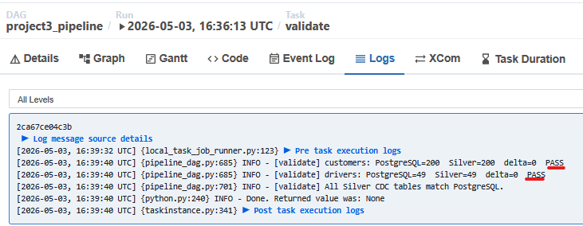

**Spot-check — 3 rows compared between Silver and PostgreSQL:**

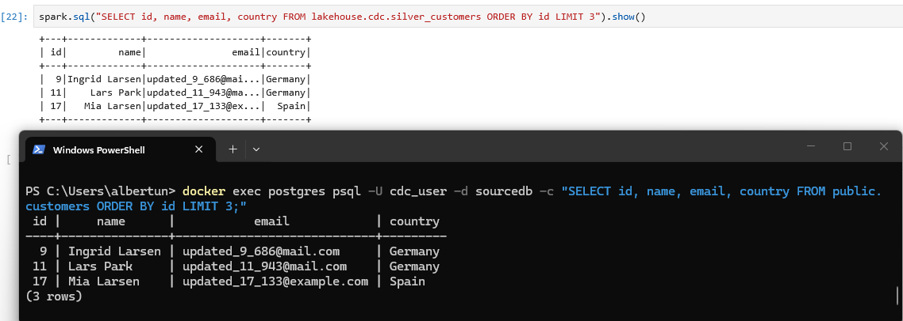

### 1.2 DELETEs are reflected in Silver

When a row is deleted in PostgreSQL, Debezium emits a CDC event with `op='d'`. The Bronze layer appends this event as-is. The Silver MERGE then deletes the corresponding row:

```sql
WHEN MATCHED AND s.op = 'd' THEN DELETE
```

### 1.3 Idempotency

Running the DAG twice with no new changes produces the same Silver state. This is guaranteed because:

- Bronze uses incremental Kafka offsets — on the second run, no new events are read so nothing is appended to Bronze.
- The Silver MERGE is idempotent by design: re-applying the same events results in the same state since UPDATE with identical values is a no-op and INSERT is gated by `WHEN NOT MATCHED`.

---

## 2. Lakehouse Design

### 2.1 Table Schemas

#### Bronze CDC (`lakehouse.cdc.bronze_customers`, `lakehouse.cdc.bronze_drivers`)

| Column | Type | Description |
|---|---|---|
| topic | STRING | Kafka topic name |
| kafka_partition | INT | Kafka partition |
| kafka_offset | BIGINT | Kafka offset (used for incremental reads) |
| kafka_timestamp | TIMESTAMP | Kafka message timestamp |
| op | STRING | CDC operation: c=create, u=update, d=delete, r=read |
| ts_ms | BIGINT | PostgreSQL event timestamp in milliseconds |
| source_lsn | BIGINT | PostgreSQL WAL Log Sequence Number |
| after_id | INT | Row ID after the change |
| after_name | STRING | Name after the change |
| after_email | STRING | Email after the change |
| after_country | STRING | Country after the change |
| before_id | INT | Row ID before the change (populated on deletes) |

**Design rationale:** Bronze is append-only and never modified. Every CDC event is stored raw including all before/after fields and Kafka metadata. This preserves the full audit trail and allows replaying history.

#### Silver CDC (`lakehouse.cdc.silver_customers`, `lakehouse.cdc.silver_drivers`)

| Column | Type | Description |
|---|---|---|
| id | INT | Primary key |
| name | STRING | Current name |
| email | STRING | Current email |
| country | STRING | Current country |
| last_updated_ms | BIGINT | Timestamp of the last change |

**Design rationale:** Silver mirrors the current state of PostgreSQL. Only one row per entity exists. Deleted rows are absent. This is the queryable source-of-truth layer for downstream consumers.

#### Bronze Taxi (`lakehouse.taxi.bronze_trips`)

| Column | Type | Description |
|---|---|---|
| kafka_partition | INT | Kafka partition |
| kafka_offset | BIGINT | Kafka offset |
| kafka_timestamp | TIMESTAMP | Kafka ingest time |
| VendorID | INT | Taxi vendor |
| tpep_pickup_datetime | STRING | Raw pickup time string |
| tpep_dropoff_datetime | STRING | Raw dropoff time string |
| passenger_count | DOUBLE | Raw passenger count |
| trip_distance | DOUBLE | Trip distance in miles |
| fare_amount | DOUBLE | Base fare |
| total_amount | DOUBLE | Total charge |
| PULocationID | INT | Pickup location ID |
| DOLocationID | INT | Dropoff location ID |
| ... | ... | Other raw fields |

**Design rationale:** Bronze stores raw Kafka events with minimal transformation. Types are kept as-is from JSON parsing. Invalid rows are kept — filtering happens in Silver.

#### Silver Taxi (`lakehouse.taxi.silver_trips`)

| Column | Type | Description |
|---|---|---|
| VendorID | INT | Taxi vendor |
| tpep_pickup_datetime | TIMESTAMP | Parsed pickup timestamp |
| tpep_dropoff_datetime | TIMESTAMP | Parsed dropoff timestamp |
| passenger_count | INT | Cast and validated |
| trip_distance | DOUBLE | Validated (>= 0) |
| fare_amount | DOUBLE | Validated |
| trip_duration_minutes | INT | Derived: dropoff - pickup |
| avg_speed_kmh | DOUBLE | Derived: distance / duration |
| pickup_zone | STRING | Enriched from zone lookup |
| pickup_borough | STRING | Enriched from zone lookup |
| dropoff_zone | STRING | Enriched from zone lookup |
| dropoff_borough | STRING | Enriched from zone lookup |
| ... | ... | Other cleaned fields |

**Design rationale:** Silver applies type casting, null filtering, range validation (speed, duration, passenger count), deduplication, and zone name enrichment. Invalid trips are dropped. This layer is safe for analytics.

#### Gold Taxi (`lakehouse.taxi.gold_demand_patterns`, `lakehouse.taxi.gold_supply_demand_gap`)

**gold_demand_patterns:**

| Column | Type | Description |
|---|---|---|
| pickup_zone | STRING | Zone name |
| hour_of_day | INT | Hour (0-23) |
| avg_trip_count | DOUBLE | Average trips across all days |
| stddev_trip_count | DOUBLE | Standard deviation of daily trip counts |
| demand_classification | STRING | high demand / normal / low demand |

**gold_supply_demand_gap:**

| Column | Type | Description |
|---|---|---|
| pickup_zone | STRING | Zone name |
| hour_of_day | INT | Hour (0-23) |
| avg_trip_count | DOUBLE | Average demand |
| drivers_available | DOUBLE | Estimated driver share for this zone/hour |
| demand_supply_gap | DOUBLE | avg_trip_count - drivers_available |
| is_underserved | BOOLEAN | True if demand exceeds driver share |

**Design rationale:** Gold aggregates Silver data into business-level insights. Raw trip records are collapsed into zone+hour statistics. Two tables serve different analytical needs: demand patterns for fleet planning, supply-demand gap for identifying underserved zones.

### 2.2 Iceberg Snapshot History

Example of iceberg snapshot history 

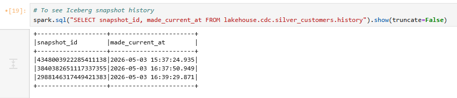

### 2.3 Time Travel

Iceberg allows querying Silver CDC at any historical snapshot using the snapshot ID from the history table above.

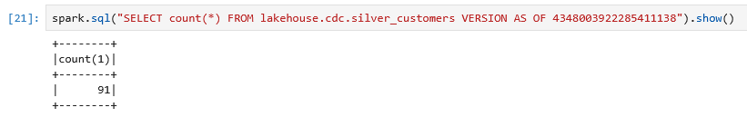

---

## 3. Orchestration Design

### 3.1 DAG Graph

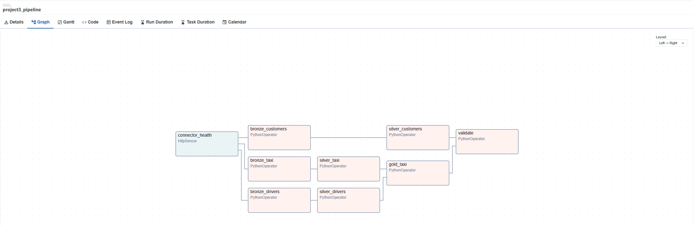

### 3.2 Task Dependency Chain

```
connector_health
    ├── bronze_customers → silver_customers ──────────────────┐
    ├── bronze_drivers   → silver_drivers ──→ gold_taxi ──────→ validate
    └── bronze_taxi      → silver_taxi    ──┘
```

**Rationale:**
- `connector_health` runs first — if Debezium is not running, the CDC path cannot produce correct data so all downstream tasks are blocked.
- `bronze_customers` and `bronze_drivers` run in parallel after the health check — they read from independent Kafka topics.
- `bronze_taxi` also runs in parallel — it is fully independent of the CDC path.
- `silver_customers` and `silver_drivers` each wait for their respective bronze tasks.
- `gold_taxi` waits for both `silver_taxi` and `silver_drivers` because the supply-demand gap table joins driver counts from Silver CDC with taxi demand data.
- `validate` runs last after both CDC silver tables and gold are complete.

### 3.3 Scheduling Strategy

For production the set schedule is `*/15 * * * *` (every 15 minutes).

**Freshness SLA:** A 15-minute schedule means Silver CDC will lag PostgreSQL by at most 15 minutes — changes made in PostgreSQL will be reflected in Silver within one DAG run cycle. This is acceptable for fleet management analytics where near-real-time (not true real-time) freshness is sufficient.

### 3.4 Retry and Failure Handling

Tasks are configured with `retries=2` and `retry_delay=timedelta(minutes=1)`. If a task fails it will be retried twice before being marked as failed. An `on_failure_callback` logs a structured `[ALERT]` message to the task log on final failure.

If `connector_health` fails (Debezium is down), all downstream tasks are skipped automatically because they depend on it in the DAG graph.

The DAG has a `dagrun_timeout=timedelta(hours=1)` — if a run exceeds one hour it is marked failed, preventing stuck runs from blocking the next trigger.

### 3.5 DAG Run History

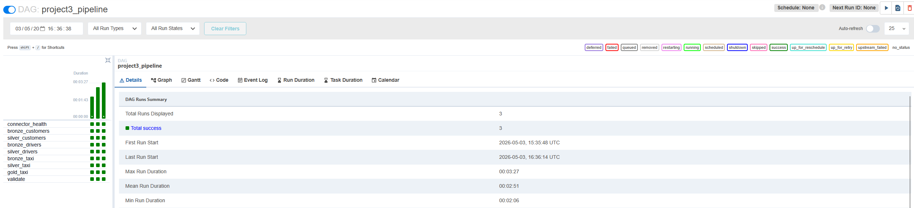


### 3.6 Backfill

The DAG has `catchup=False` which means Airflow will not backfill missed runs when the DAG is unpaused. Since `schedule=None` is used during development, backfill is not applicable. If the schedule were re-enabled, re-running for the same interval produces the same result because:
- Bronze reads are incremental (offset-tracked) — no duplicate appends
- Silver MERGE is idempotent — same events produce same state

---

## 4. Taxi Pipeline

### 4.1 Bronze → Silver → Gold correctness

Taxi pipeline counts:

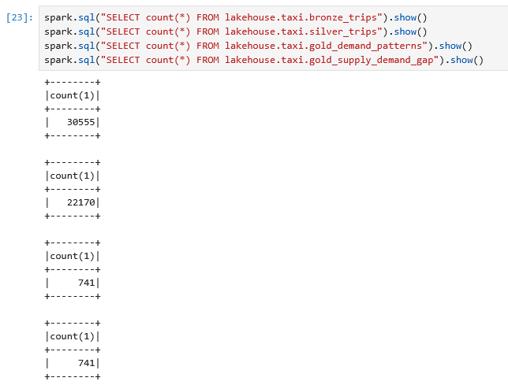

Gold level output:
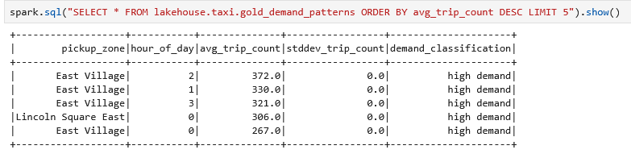

### 4.2 Improvements over Project 2

* Moved from standalone streaming notebook to Airflow-orchestrated batch pipeline
* Replaced continuous readStream with incremental batch reads using Kafka offset tracking stored in Iceberg
* Added kafka_offset DESC as a tiebreaker in deduplication on top of ts_ms DESC
* Added lower bound speed filter (avg_speed_kmh >= 2) alongside the existing upper bound
* Added a second gold table (gold_supply_demand_gap) that joins taxi demand with CDC driver counts
* Added task-level retries, DAG timeout, and connector health check that blocks all downstream tasks on failure
* Added a validation task that compares Silver row counts against PostgreSQL using REPEATABLE READ isolation
---

## 5. Custom Scenario — Fleet Demand Analysis

Our custom scenario (GitHub issue) requires building a gold layer that helps a hypothetical fleet management team understand trip demand patterns and identify underserved zones.

### 5.1 gold_demand_patterns

For each pickup zone and hour of day, we compute the average and standard deviation of daily trip counts across all days in the dataset. Zones/hours are then classified:

- **High demand:** `avg_trip_count >= city_avg + city_stddev`
- **Low demand:** `avg_trip_count <= city_avg - city_stddev`
- **Normal:** everything in between

### 5.2 Key Analytical Queries

Queries are also in etc/Peakhours-demand-forecasting-report-answers.ipynb

**Which 3 zones have the most predictable demand (lowest stddev)? Example:**

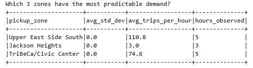

**At what hour does demand peak city-wide? Example:**

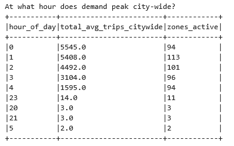

### 5.3 gold_supply_demand_gap

The supply-demand gap table cross-references taxi demand with the number of active drivers in `silver_drivers`. Driver count is distributed proportionally across zones based on each zone's share of citywide demand for that hour. Zones where `avg_trip_count > driver_share` are flagged as underserved.

**Which zones are underserved? Example:**

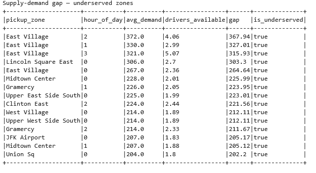

---

## 6. MERGE Logic and Idempotency

The Silver CDC MERGE works as follows:

1. All bronze events are deduplicated by primary key, keeping only the latest event per entity (ordered by `ts_ms DESC`, ties broken by `kafka_offset DESC`).
2. The deduplicated batch is written to a staging Iceberg table.
3. A `MERGE INTO` is applied from staging to Silver:
   - If the entity exists in Silver and the latest op is `'d'` → DELETE
   - If the entity exists in Silver and the latest op is `'c'`, `'u'`, or `'r'` → UPDATE
   - If the entity does not exist in Silver and the latest op is not `'d'` → INSERT

**Why it is idempotent:** Re-running the MERGE with the same staging data produces the same result. UPDATEs with identical values are no-ops at the data level. INSERTs are gated by `WHEN NOT MATCHED` so duplicates cannot be inserted. DELETEs on already-absent rows match nothing and are skipped. The incremental offset tracking ensures the same bronze events are never re-appended, so the staging batch is always identical for the same input state.

---

## 7. Connector Configuration

The Debezium PostgreSQL connector is registered via the Kafka Connect REST API. The configuration is saved in `connector.json` in the repository root.

---

## 8. Environment Setup

Copy `.env.example` to `.env` and set the following values:

| Variable | Description | Example |
|---|---|---|
| MINIO_ROOT_USER | MinIO admin username | admin |
| MINIO_ROOT_PASSWORD | MinIO admin password | admin123 |
| AWS_ACCESS_KEY_ID | Must match MINIO_ROOT_USER | admin |
| AWS_SECRET_ACCESS_KEY | Must match MINIO_ROOT_PASSWORD | admin123 |
| PG_USER | PostgreSQL CDC user | cdc_user |
| PG_PASSWORD | PostgreSQL CDC password | admin |
| AIRFLOW_USER | Airflow UI username | admin |
| AIRFLOW_PASSWORD | Airflow UI password | admin |
| JUPYTER_TOKEN | Jupyter notebook token | admin |

**Important:** `AWS_ACCESS_KEY_ID` must equal `MINIO_ROOT_USER` and `AWS_SECRET_ACCESS_KEY` must equal `MINIO_ROOT_PASSWORD`. Mismatched values will cause S3 signature errors when Spark writes to MinIO.